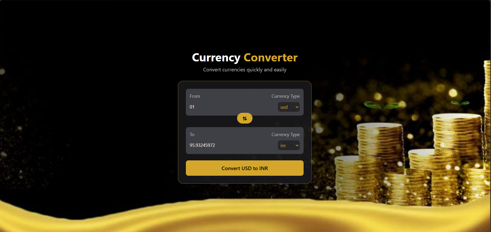

# 💱 Currency Converter

A clean and responsive currency converter built with React and Tailwind CSS. It allows users to convert between different currencies using live exchange-rate data.

## ✨ Features

- 🔄 Convert between multiple currencies
- 💱 Live exchange-rate data from a currency API
- 🔁 Swap "From" and "To" currencies
- 🎨 Clean black and gold UI
- 📱 Responsive design
- ⚡ Fast and lightweight React application
- 🌐 Dynamic currency dropdown
- 🧩 Reusable `InputBox` component

## 🖥️ Preview

## 🛠️ Tech Stack

- React
- JavaScript
- Tailwind CSS
- Vite
- Currency API

## 📂 Project Structure

currencyConverter/
│
├── public/
├── src/
│   ├── components/
│   │   └── InputBox.jsx
│   │
│   ├── hooks/
│   │   └── usecurrencyInfo.js
│   │
│   ├── App.jsx
│   ├── App.css
│   └── main.jsx
│
├── index.html
├── package.json
└── vite.config.js

🚀 Getting Started

1. Clone the repository
git clone https://github.com/KavyaSharma77/currencyConverter.git
2. Navigate to the project
cd currencyConverter
3. Install dependencies
npm install
4. Start the development server
npm run dev

Open the local URL shown in the terminal to run the application.

🔑 How It Works

The application gets exchange-rate information using an external currency API.

The selected currency is passed to a custom React hook:

const currencyInfo = UseCurrencyInfo(from);

The available currencies are then obtained dynamically:

const options = Object.keys(currencyInfo);

The user enters an amount and selects the source and target currencies.

When the Convert button is clicked, the application calculates the converted value using the exchange rate received from the API.

The Swap button exchanges the selected source and target currencies.

🧩 React Concepts Used

This project uses several important React concepts:

Functional Components
useState
useEffect
Custom Hooks
Props
Controlled Inputs
Event Handling
Component Reusability
Conditional rendering
📚 What I Learned

While building this project, I practiced:

Building reusable React components
Managing state with useState
Fetching API data with useEffect
Creating and using custom hooks
Passing data through props
Working with JavaScript map()
Handling form submission
Integrating an external API
Styling with Tailwind CSS
Using Git and GitHub for version control

🎯 Future Improvements

Add currency search
Add loading states
Add API error handling
Add conversion history
Add more detailed exchange-rate information
Add a chart for exchange-rate trends
Deploy the project online

👩‍💻 Author

Kavya Sharma

GitHub: @KavyaSharma77
